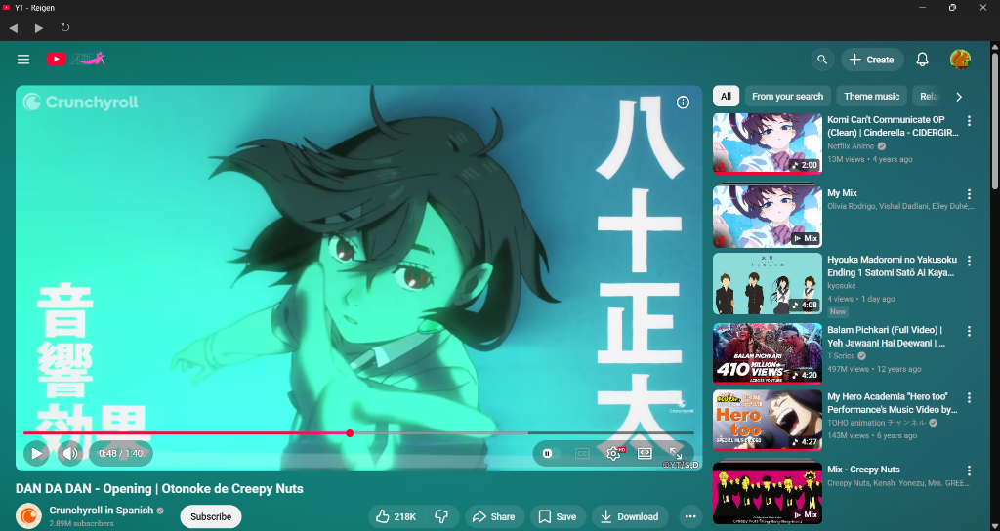
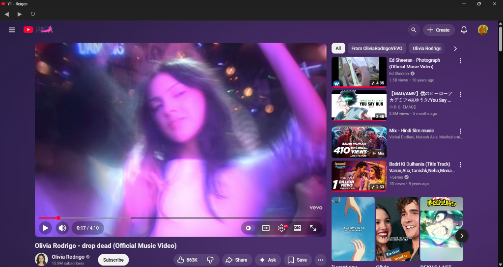

# YT - Reigen

A minimalist, ad-free YouTube desktop experience built with Electron.

## Features

- **Ad-Free Experience**: Utilizes a dual-layer approach with network-level domain blocking and a DOM-level interceptor to automatically skip or mute video ads and remove banner ads.
- **Cinematic & Transparent UI**: A custom, distraction-free interface that pierces through YouTube's native styling, making the layout transparent and focusing entirely on the content.
- **Ambient Glow Effect**: Features a real-time, dynamic ambient background glow that matches the colors of the currently playing video.
  <br>
  
  <br>
  
  <br>
  
- **Custom Minimalist Search**: A refined, unobtrusive search bar overlay that declutters the default YouTube masthead.
- **Optimized Performance**: Leverages GPU acceleration, native GPU memory buffers, and zero-copy flags for smooth playback and rendering.
- **Custom Navigation Toolbar**: Includes a sleek, built-in toolbar for basic navigation (Back, Forward, Reload) that auto-hides in fullscreen mode.

## Installation

### Prerequisites

- [Node.js](https://nodejs.org/) installed on your system.

### Setup

1. Clone the repository:
   ```bash
   git clone https://github.com/SaishNehe05/YT-Reigen.git
   cd YT-Reigen
   ```
2. Install the necessary dependencies:
   ```bash
   npm install
   ```

## Usage

To run the application locally in development mode:

```bash
npm start
```

## Building for Production

To create an installer for your operating system:

```bash
npm run dist
```

This uses `electron-builder` to package the app and generate the executable/installer in the `dist/` directory.

## Project Structure

- `main.js`: The main Electron process handling window creation, ad-blocking (network level), and IPC communication.
- `preload-youtube.js`: The preload script injected into the YouTube view, responsible for the cinematic UI, ambient glow, and DOM-level ad interception.
- `preload-toolbar.js` & `toolbar.html`: The custom navigation toolbar interface and its logic.
- `package.json`: Project configuration, scripts, and build settings.

## License

ISC
